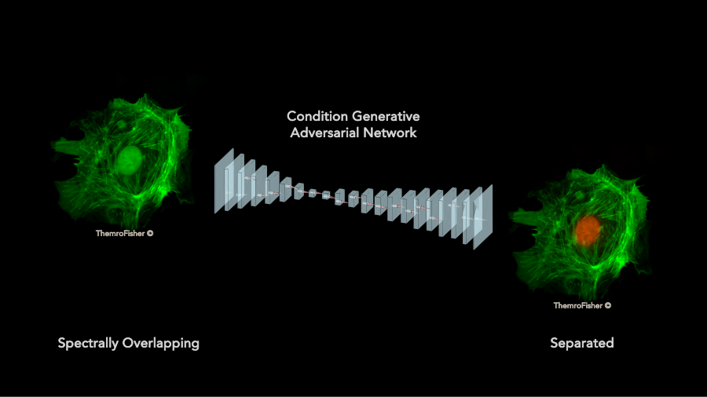
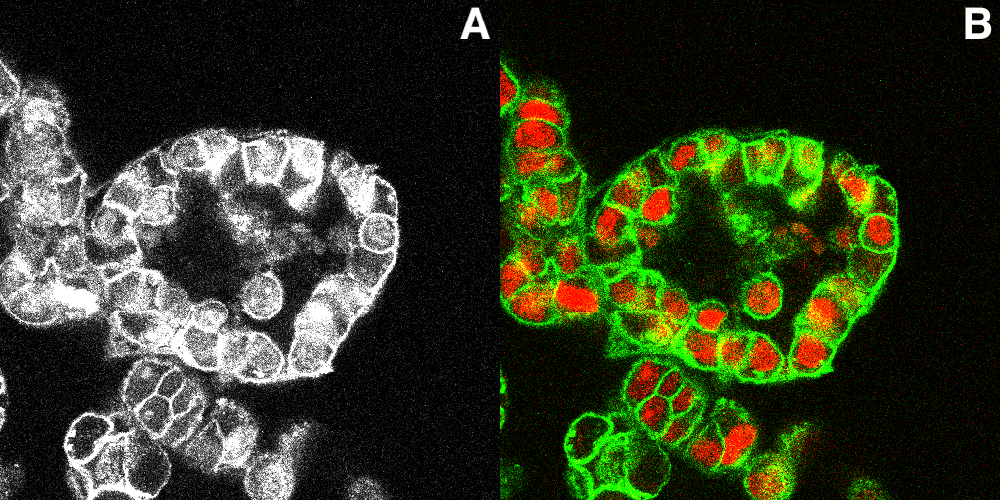

# DLmorphometric-unmixing3D
Deep learning based approach for morphometric un-mixing of ex vivo multiplex 3D imaging data



<p align="justify">
The use of multiple fluorophores at the same time for the visualization of cellular structures can result in spectral overlap that makes it difficult to capture each signal independently. This project introduces a deep learning-based approach that employs a conditional generative adversarial network (cGAN) for un-mixing signals of cellular markers emitting the same fluorescent spectra into separate signals according to their sub-cellular distribution. As an alternative to conventional linear unmixing methods, this novel approach demonstrates its capability of separating signals when trained on both synthetic and real data derived from a 3D image of breast cancer organoids.

The repository contains the following:

- Code to generate training and testing data from beast cancer organoids 3D image dataset in CZI format

- Examples of generated data with various augmentation steps

- Deep learning training and testing examples 

- Code for calculating metrics and examples
</p>

## Datasets

### Preparing your own datasets for pix2pix
<div align="justify">

Paired images are the required input format for pix2pix training and testing. A Python script is provided here to generate training & testing data in the form of pairs of images [A,B] by extracting patches from the 3D dataset. **A** represents the source image with mixed signal, and **B** represents the target image with the un-mixed signal.

\

**GenerateData.sh** is the bash script where all the parameters can be entered for running **DataGenerator.py**. The parameters contain the following options: 

- File path for the 3D dataset. This patch extraction tool was designed only for the CZI file format with 3 channels, where the first and second are two different cellular markers, e.g., ch1 = CDH1 (membrane), ch2 = KI67 (nuclear), and ch3 = mixed signal (open detector).

- Percentile value (float) that will be used to normalize the data based on the parameter option given in --Normalization.

- Selection of patch size. This cannot exceed the size of the tile in the CZI file.

- Number of channels must be set to 3 (further updates could remove this option). 

- The bottom and top layers are selected to indicate the z-axis range from which patches are extracted.

- "Biosample" allows you to enter a name for the dataset folder according to the organism from which the 3D image was acquired.

- Selecting dataset sizes for the training and testing. When setting the --DataSize parameter, e.g., 1000, the code will generate 1000 training images and 10%, in this case 100 images will be generated for the testing.

- Creating real, synthetic, or weighted blended data using "DataMode". When using the weighted blending option, the --Alpha parameter must be defined. The given alpha value is applied to ch1, and a (1-alpha) is automatically calculated for ch2.

- Two different normalization approaches can be set. The first is to normalize each channel using its corresponding calculated percentile value. The second is to normalize all three channels using the calculated percentile value of the third channel.

- Brightness augmentation can be implemented by entering an integer representing the percentage of data that will contain brightness variation. The brightness range is fixed and can be adjusted in the code.

After running the script will create a folder with subdirectories training, testing, and validation. 

</div>

## Trainings

<div align="justify">

The [Pix2Pix](https://github.com/junyanz/pytorch-CycleGAN-and-pix2pix.git) repository was used for the trainings. This framework can be run on Linux or Mac OS using Python 3 and either a CPU or an NVIDIA GPU with CUDA CuDNN. To train a model, the pix2pix includes several parameter settings that can be changed for training. 

### Training example
The **DataGenerator.py** creates folders with the foldername specified by the pix2pix. To load the training or testing data created with the **DataGenerator.py**, a path to the generated dataset folder must be specified for the -—dataroot option. The following is a training example bash script:

</div>

```
python train.py --dataroot ./datasets/bc_organoid_synthetic_patches_data_1k --name bc_organoid_1k_synthetic_100ep_n_epochs_100_n_epochs_decay_100_netG_resnet_9blocks --model pix2pix --direction AtoB --display_winsize 256 --load_size 512 --gan_mode lsgan --n_epochs 100 --n_epochs_decay 100 --netG resnet_9blocks
```

More information on network training options can be found in [base_options.py](https://github.com/junyanz/pytorch-CycleGAN-and-pix2pix/blob/master/options/base_options.py) and [train_options.py](https://github.com/junyanz/pytorch-CycleGAN-and-pix2pix/blob/master/options/train_options.py). 


## Metrics


